```{r setup, include=FALSE}
options(htmltools.dir.version = FALSE)
knitr::opts_chunk$set(
  fig.width=9, fig.height=3.5, fig.retina=3,
  out.width = "100%",
  cache = FALSE,
  echo = TRUE,
  message = FALSE, 
  warning = FALSE,
  hiline = TRUE
)
```

```{r xaringan-themer, include=FALSE, warning=FALSE, echo=FALSE}
library(xaringanthemer)
# install.packages("devtools")
# devtools::install_github("hadley/emo")
# xaringan::inf_mr()

style_duo_accent(
  primary_color = "#505680",
  secondary_color = "#63698b",
  inverse_header_color = "#d4c2b6"
)

xaringanExtra::use_panelset()

xaringanExtra::style_panelset_tabs(
  active_foreground = "#0051BA",
  hover_foreground = "#d22",
  font_family = "Roboto"
)

```

class: center, middle

## Hi All


.footnote[
Source: [Giphy](https://www.google.com/url?sa=i&url=https%3A%2F%2Fgiphy.com%2Fexplore%2Fhiiiii&psig=AOvVaw2Lm0h_EsjtoDP_NIV8X5pI&ust=1634298879350000&source=images&cd=vfe&ved=0CAsQjRxqFwoTCNjAyNjsyfMCFQAAAAAdAAAAABAE)]


---

## Topics to be covered `r emo::ji("pen")`

.pull-left[
### `r emo::ji("small_orange_diamond")` About the Project

### `r emo::ji("small_orange_diamond")` Analysis 

### `r emo::ji("small_orange_diamond")` Walk through of App

### `r emo::ji("small_orange_diamond")` Conclusion

### `r emo::ji("small_orange_diamond")` Q&A
]

.pull-right[

]

---
class: center, middle, inverse
# About the Project

---

# About the Project

.panelset[
.panel[.panel-name[Project Aim `r emo::ji("target")`]

* To analyse the transmission of viruses

* And build few visual representations of the analysis

]
.panel[.panel-name[Arbovirus `r emo::ji("microbe")`]  

.pull-left[

 write about arbovirus

.pull-left[

####  Imported

* CHIKV

* JEV

* ZIKV

* DENV

* WNV


]
.pull-right[

####  Local

* RRV

* MVEV

* BFV

* DENV

* WNV

]


.pull-right[


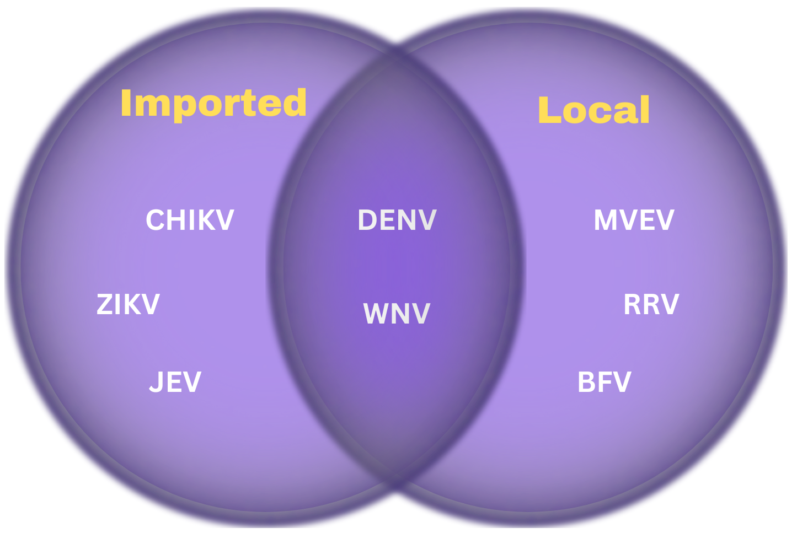
     
]

]


]

.panel[.panel-name[SA3 Regions `r emo::ji("world_map")`]


#### what are SA3 regions?

* Dealing with **312** SA3 Regions

* point 2

* point 3


<a href="https://maps.abs.gov.au/">
        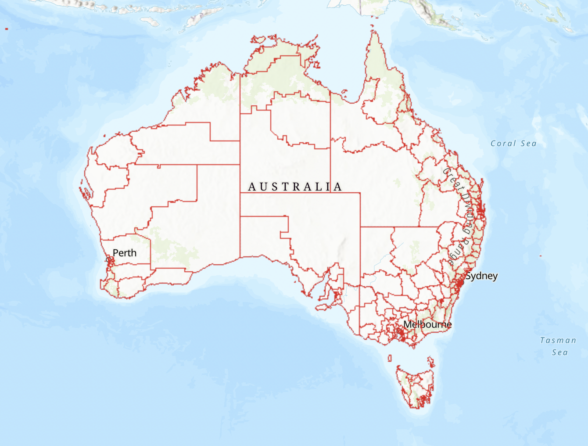
        <div class="caption">Image Source: Australian Bureau of Statistics</div>
</a>

]
]


---
# Data `r emo::ji("floppy_disk")` 

.panelset.sideways[

.panel[.panel-name[Data Provided]  

* We were given two data sets
  * fulldata.csv and imported.csv
  
* We used two shape files:
  * one for generating SA3 region maps and other for world map


]

.panel[.panel-name[Data Gathered]  

* Methods of data preprocessing
  * Files like modules and data preprocessing in shiny app
  
* points

]

.panel[.panel-name[Data Pre-processing]  

* Methods of data preprocessing
  * Files like modules and data preprocessing in shiny app
  
* points

]
]

---
class: center, middle, inverse
# Analysis


---

# Imported Cases `r emo::ji("mosquito")` 

.pull-left[
* points
* points
]


.pull-right[
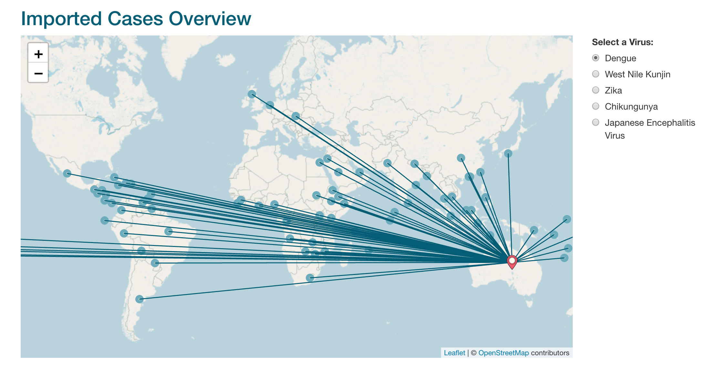
]
---

# Local Transmission `r emo::ji("mosquito")` 
.pull-left[
* points
* points
]


.pull-right[
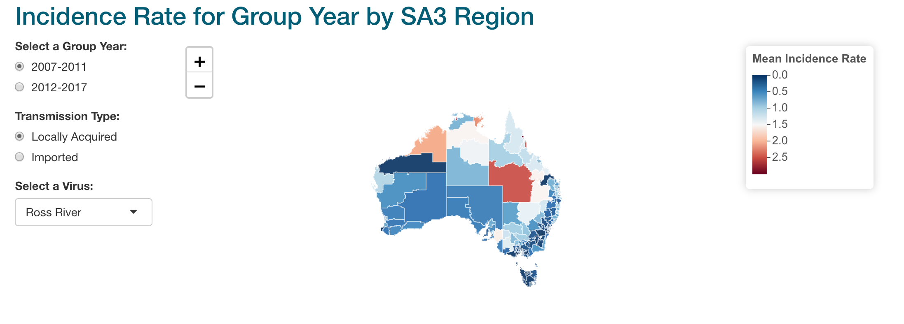
]


---

# Blood Donation Rate `r emo::ji("syringe")` 

.pull-left[
* points
* points
]


.pull-right[

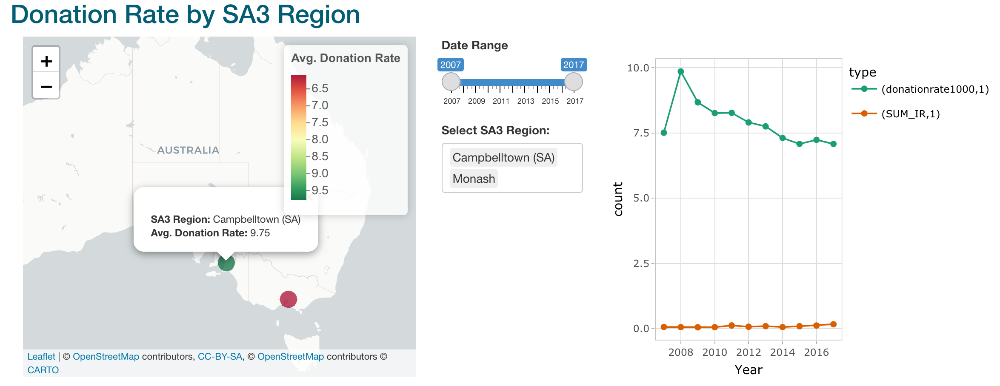

]


---
# Statistical Analysis `r emo::ji("desktop_computer")` 

### Negative Binomial

.panelset.sideways[


.panel[.panel-name[When to perform?]  
.pull-left[
* Negative Binomial is performed when the data is **over dispersed**.

* The conditional variance exceeds the conditional mean.

]
.pull-right[
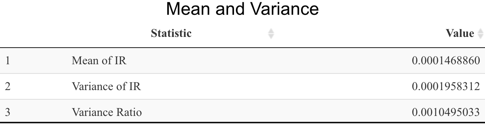
]
]


.panel[.panel-name[Different Models]

.pull-left[
* `donation rate` as our response variable and the `incidence rate` as the explanatory variable for all the models.

* The Akaike Information Criterion is a metric used to evaluate the quality of a model. 
]

.pull-right[
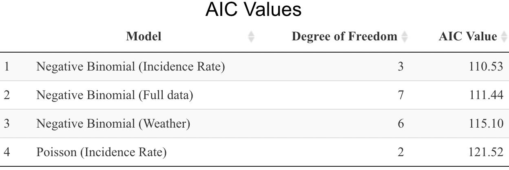
]

<br>
* Low complexity and a **good fit** are indications of a model with a **low AIC.**

]

.panel[.panel-name[Model Summary]
.pull-left[
* median deviance residual is almost zero, our model is **not biased.**

* we are 15 standard deviations below the mean

* Negative correlation between response and explanatory variables.

* If `incidence rate` `r emo::ji("small_red_triangle_down")`, the `donation rate` also goes `r emo::ji("small_red_triangle_down")`
]


.pull-right[
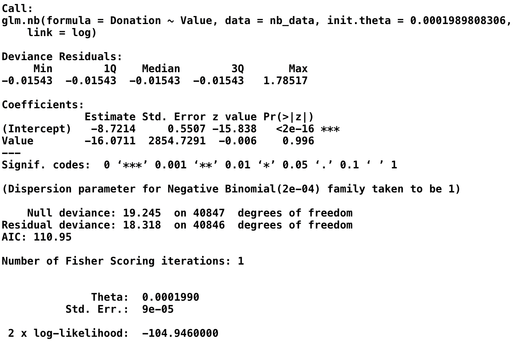
]
]
]


---
# Statistical Analysis `r emo::ji("computer")` 

## PCA Biplot

.pull-left[
* points
* points
]


.pull-right[
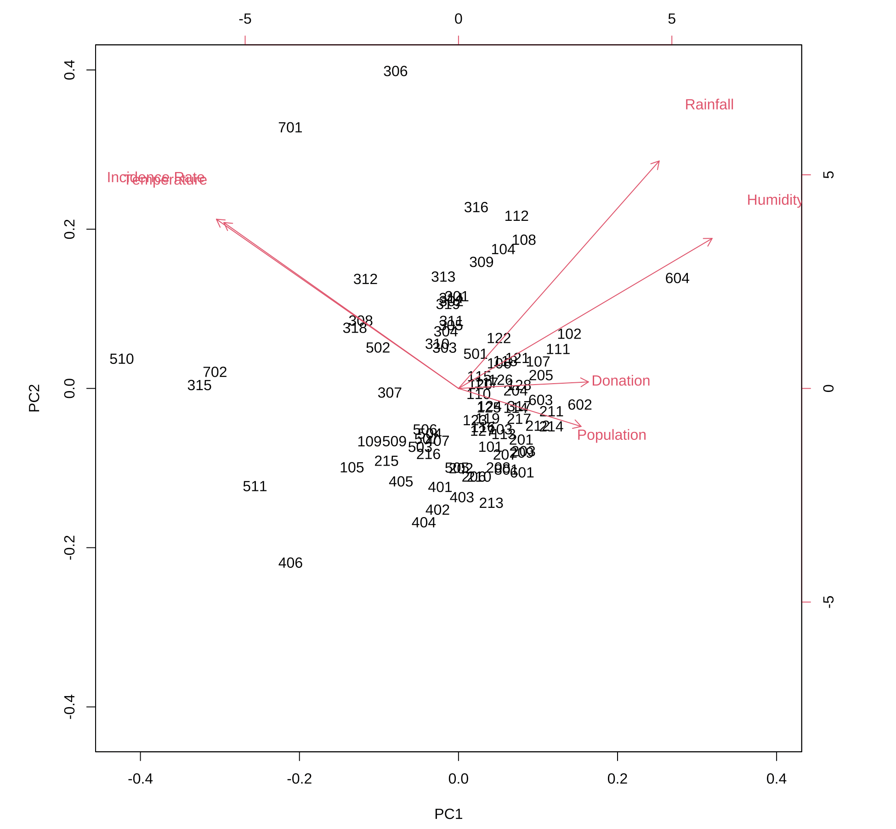
]

---

# Weather Conditions
## Temperature `r emo::ji("thermometer")`

.panelset[
.panel[.panel-name[Overview]  
.pull-left[

- A positive correlation exists between average temperature and incidence rate.

- Important behaviors such as blood-feeding and mating are also affected by temperature
]


]

.panel[.panel-name[Map]
.pull-left[
- The temperature decreases gradually from North to South

- No proper relation can be deduced from SA3 region and average temperature
]

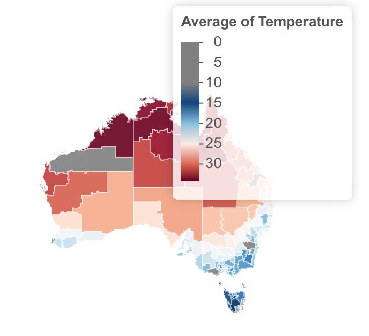
]

.panel[.panel-name[Graph]
.pull-left[
- There is no clear increase or decrease in average temperature and average incidence rate over time

- Temperature has a significant influence on life history traits of vectors at both immature and adult life stages
]

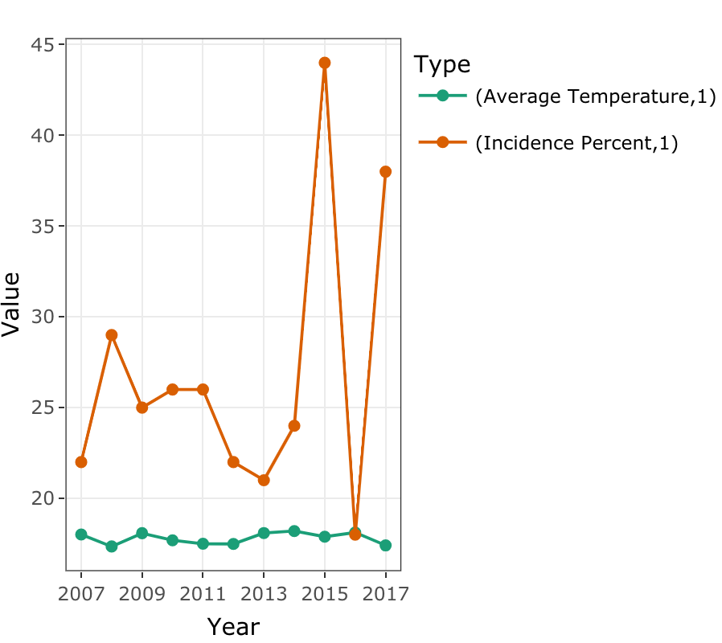
]
]


---

# Weather Conditions

## Rainfall `r emo::ji("umbrella")`

.panelset[
.panel[.panel-name[Overview]  
.pull-left[
- Rainfall and Incidence Rate show a positive correlation

- Increases in rainfall can increase vector populations and transmission

- This is due to increased number of water filled containers near dwelling
]


]

.panel[.panel-name[Map]
.pull-left[
- Places like Cassowary Coast, Port Douglas (Coastal regions) have higher rainfall rate

- No distinct relationship between rainfall, incidence rate and SA3 region
]

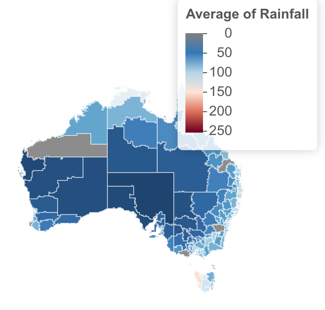
]

.panel[.panel-name[Graph]
.pull-left[
- There is no clear increase or decrease in rainfall rate and average incidence rate over time

- Drought and water scarcity can also increase vector populations if people begin to store water in containers around the home
]

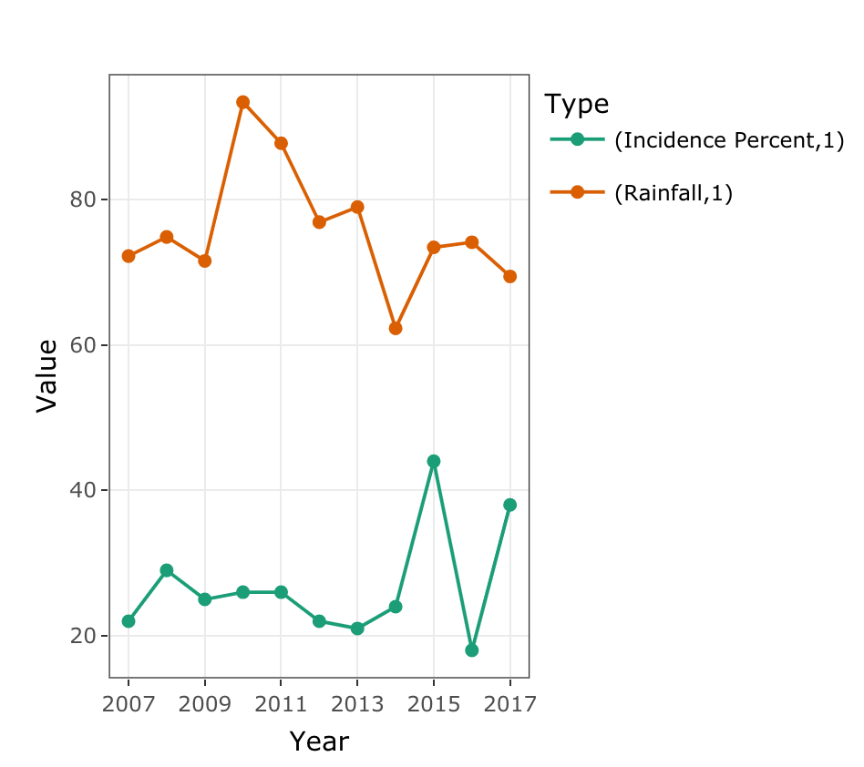
]
]


---

# Weather Conditions

## Humidity `r emo::ji("droplet")`

.panelset[
.panel[.panel-name[Overview]  
.pull-left[

- Negative correlation between humidity and incidence rate

- However, mosquito's vector competence might get reduced, because of the diversion of available cellular resources for its own maintenance.

- Few other studies also suggest that it is difficult to predict the actual effect of humidity on vector competence.

]


]

.panel[.panel-name[Map]
.pull-left[
- Average humidity is high in coastal regions

- Regions with higher humidity have lower incidence rates
]

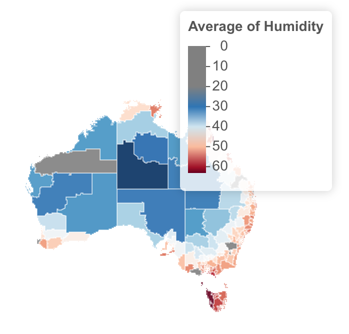
]

.panel[.panel-name[Graph]
.pull-left[

- There is no clear increase or decrease in humidity and average incidence rate over time


- Egg production has shown to increase with increase in relative humidity
]

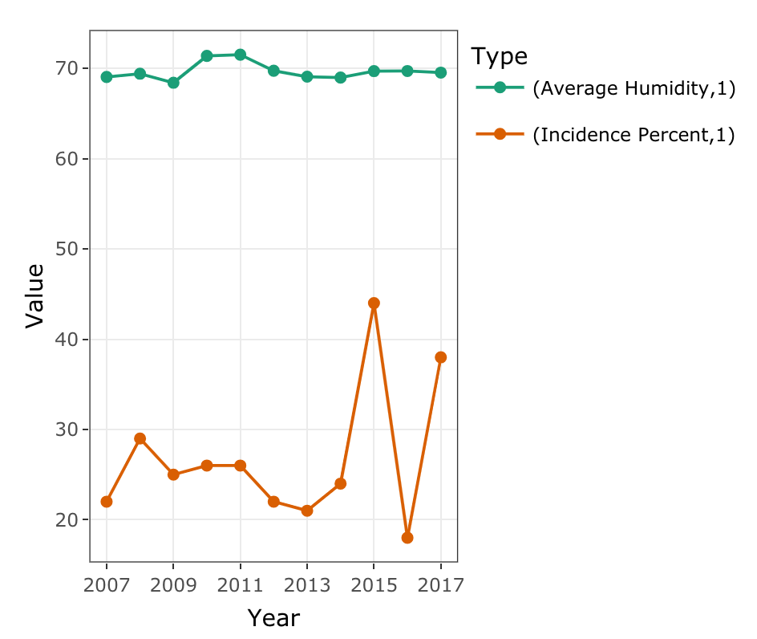
]
]

 

---
class: center, middle, inverse
# Walkthrough of RShiny App


---
# Epilogue `r emo::ji("scroll")`

`r emo::ji("pushpin")` Developed both leaflet and sf maps

--

`r emo::ji("pushpin")` Explored Negative Binomial Model

--

`r emo::ji("pushpin")` Improved our project management skills

--

`r emo::ji("pushpin")` Learnt to actively use GitHub in a more extensive manner

--

`r emo::ji("pushpin")` Refined our knowledge in processing of enormous datasets


---
class: center, inverse

.pull-top[
<br>
<br>
# Thankyou
]

--

.pull-bottom[


]

.footnote[
Source: [Tenor](https://media.tenor.com/X73EqPfwAfIAAAAC/minion-any-questions-question.gif)]

