```{r setup, include=FALSE}
## Global options
knitr::opts_chunk$set(cache = FALSE,
                      echo = FALSE,
                      message = FALSE,
                      warning = FALSE)
```

```{r}
library(tidyverse)
library(DT)
```

## Abstract

This report aims to explain the spread of arthropod-borne viruses or arbovirus. This is a term that is generically used to describe infections caused by viruses through the bite of infected arthropods or insects like mosquitoes and ticks. The spread of these viruses began in the 1800s and continues to be a major threat to public health in Australia and around the world. Emerging or re-emerging vector-borne diseases are a significant concern for global health. A thorough understanding of diseases and interactions in their natural setting is crucial for developing successful diagnostics, vaccinations, and other control methods. The purpose of this report is to present the role of arboviruses in Australia's Statistical Area Level 3 (SA3s) regions. The project is created entirely with R studio and analyzes data using the programming language R. This work catalyses the implementation of an R Shiny App that will provide future insights into the analysis of Arbovirus transmission within and outside of Australia under various conditions. Given that arboviruses are of concern because of their potential impact, on both, the safety and the supply of products, possible implications for blood transfusion safety will be discussed. Various weather conditions like temperature, humidity, and rainfall and their implications on the donation rate and incidence rate were also analysed. Furthermore, statistical data modelling has resulted in a better understanding of the interactions between the variables associated with arboviral transmission.

### Keywords

*Arbovirus, R Shiny App, Statistical Area Level 3 SA3 Region, Ross River virus (RRV), Dengue virus (DENV), Barmah Forest virus (BFV), Zika virus (ZIKV), Murray Valley Encephalitis virus (MVEV), West Nile virus/Kunjin virus (WNV), Japanese Encephalitis virus (JEV), Chikungunya virus (CHIKV)*

## Background

Today, Ross River virus (RRV), Barmah Forest virus (BFV), and dengue virus (DENV) are three of the most common and clinically relevant arboviruses in Australia. Since 2002, Australia has observed a rise in mosquito-borne infections, with fears that this trend may continue due to climate change. Arboviral transmission is a concern "as a result of geographical and temporal patterns of vector breeding habitats and variables influencing dispersal" (Dale et al., 1998). Environmental patterns and factors that impact viral dispersion, as well as spatio-temporal dynamics of disease transmission, must be studied in order to forecast and prevent future arbovirus transmission in Australia.

Although Australia has documented more than 70 arboviruses, only a few are human pathogens (such as viruses, bacteria, fungi, protozoa, and worms), and almost rare concerns are profound. The viruses which have given rise to substantial human illness in Australia are the flaviviruses and alphaviruses. The most common flaviviruses are West Nile/Kunjin, Japanese Encephalitis, Murray Valley Encephalitis, and Dengue virus, whereas the most familiar alphaviruses are Ross River and Barmah Forest virus. (Arboviral Diseases and Malaria in Australia, 2007/08: Annual Report of the National Arbovirus and Malaria Advisory Committee, 2009)

It has become more bothersome because each virus has a distinct ecological and pathological characteristic as well as a potential to spread and establish in new areas. The objective of this study is to summarise the behaviours of a few of such viruses and to discuss recent findings on their ecology and dissemination by understanding the different variables that may affect their transmission. Several recent publications provide greater insight into the epidemiology of these viruses.


## Objectives and Significance

Our overall aim was to understand the arbovirus transmission over time and space. It can be further broken down into the following: 

1. Developing an RShiny application to visualise the evolution of the transmission of seven viruses over a period of 15 years, in Australian SA3 regions.

2. Investigate any regions where there is a danger of viral transmission, and determine whether any regions with a high rate of blood donation are also regions with a high virus incidence rate.

3. Examination of weather conditions and their association with the incidence rate of viruses.


## Ethical approval

The Lifeblood Ethics Committee approved the project Viennet 12012021b on the 19th of January 2021.

## Data and Methodology

### Study Area

According to the 2011 standard of Statistical Area Level 3 (SA3) categorisation, this study includes 334 SA3 areas that make up the geographic area of Australia (Main Features - Main Features, 2011). The Australian Bureau of Statistics (ABS) developed the SA3 region categorisation system for the purpose of analysing regional statistics. SA3 areas are big enough to prevent patients from being recognised but compact enough to qualify for a detailed breakdown of meteorological and climate data (Main Features - Main Features, 2011). The states of Queensland, New South Wales, South Australia, Western Australia, Victoria, and Tasmania were included in the research. The Australian Capital Territory, the Northern Territory, Jervis Bay, Christmas Island, Norfolk Island and the Cocos (Keeling) Islands, were also included.


### Dataset

#### Data provided

There were 2 main datasets that were provided to us. These 2 data sets formed the basis of our choice of visualisations and research questions. 

1. A CSV file containing incidence rate for locally transmitted and imported viruses along with information about the Year and month of transmission, geographical data (SA3 and SA4 regions), weather conditions during that particular day which includes rainfall, humidity and temperature, the population of that particular geographical region and blood donation rate.  The name of the viruses was also provided as abbreviations.
2. An XLSX file containing data relating to the imported case count with respect to the country of origin and virus.

#### Data gathered

Our main aim in this project was to build visualisations that show the arbovirus transmission in Australia. For this, we required data relating to the geometric locations like the boundaries and coordinates and other such information about geographic features. So, we gathered data relating to:

1. The SA3 region boundaries as of the 2011 census from the Australian Bureau of Statistics. 

2. The bounds of all countries around the world to show the different countries from which the cases are being imported into Australia. 

Populations were classified based on the ABS 2016 SA3 region categorisation system for the human population. (Australian Statistical Geography Standard (ASGS) | Australian Bureau of Statistics, 2022). However, the information on RRV and BFV case notifications was categorised using the 2011 SA3 method (Main Features - Main Features, 2011). There were minimal differences between the 2011 and 2016 SA3 systems, namely the splitting of numerous areas into two for the 2016 iteration. (Australian Statistical Geography Standard (ASGS) | Australian Bureau of Statistics, 2022). The fragmented SA3 areas were merged back together to match the 2011 SA3 borders once these modifications were rectified in the human population dataset. This was done in order to correctly combine the datasets on the human population with the datasets on blood donation and case notification. The Australian human population and all case notification data were used to compute infection rates per 10,000. Only blood donations and the Australian population between the ages of 20 and 69 were used to compute blood donation rates. Records of blood donations that were made in states other than those where the donor's SA3 place of residence was listed were also eliminated.


#### Data Pre-processing

The data that was provided to us and the data that we collected were both thoroughly checked and pre-processed so that it was ready for the next step in our project. This is where the raw data was made coherent and transformed into a more accessible form. Raw datasets are typically characterised by incompleteness, inconsistencies, a lack of behaviour, and patterns, as well as mistakes (Acheme & Vincent, 2021). Basic preprocessing steps like checking for missing values, noise in the data, and other discrepancies were checked for and addressed accordingly. 

**1. Check for NA values:** NA values means not available and indicate missing values.  All the datasets were checked for NA values. Since the datasets provided to us were quite clean, there were not many columns that contained NA values. However, the columns related to donation rate did contain “ “% of missing values. Since the donation rate column is one of the explanatory variables in our analysis, we decided to omit the rows with NA values only when using the donation rate as part of our statistical modelling. While creating visualisations, these NA values were converted to 0s. The other datasets that were collected were all spatial data frames and because they contain only spatial information that is already in the data they did not contain any NA values. 

**2. Removing unrecognised country names:** The column country name contained names of different countries. However, when we had a closer look at the unique countries, we found that there were country names like Overseas - Country Unknown, At Sea, Country Unknown, etc. Rows with such fictitious country names were removed during the analysis of imported cases since this would give us incorrect information. 

**3. Imputing country names:** The dataset also contained inaccurate country names like China (excludes SARs), Venezuela, the Bolivarian Republic of, the United Kingdom, the Channel Islands and the Isle of Man which will not be mapped properly to the dataset that was collected by us. So, these country names were converted into simpler names like China, Venezuela, United Kingdom, etc. 

**4. Checking for outliers:** Since there were multiple numerical columns and the statistical analysis will be purely based on these numerical variables, we checked for outliers in these numerical columns. Outliers are the most distant values that deviate from most of the data points in the data set thereby skewing the data. They can distort the findings of a hypothesis test and also have a significant influence on the statistical analysis (Liu, Shah & Jiang, 2004).

**5.** A dataset is considered tidy when “each variable has its open column and each observation is in its row” (Wickham & Grolemund, 2016). The dataset had the virus names as part of the column name and these had to be changed into a separate column so that it follows the above-mentioned principle of tidy data. Therefore, the data was converted into a long format with the virus names as a separate column. This gave the dataset a good structure. 

After completing all the pre-processing, the dataset contained information from 2007 through to 2017. The viruses that were part of the data set were CHIKV, DENV, RRV, MVEV, WNV, ZIKV and JEV. Some viruses such as RRV, MVEV, BFV, DENV, WNV are locally-acquired (LA), meaning they were acquired within Australia. While other viruses like DENV, WNV, CHIKV, ZIKV, and JEV are imported or were transmitted from outside Australian borders. The Donation rate has the number of donors divided by the population size. Weather information like the average rainfall, maximum and minimum temperatures, relative humidity, and lag of each variable at 1 month, 2-month and 3-months. The R code used for data pre-processing can be found in our GitHub repository under the folder *Lifeblood-Arbovirus-App/DataPreprocessing.R*

## Creating Visualisations

Data visualisations alleviate the relationship between the variables by highlighting the relationship and trends in the data. Visualisations help present and communicate large data sets into a more comprehensible form (Kelleher & Wagener, 2011). We selected different visualisations to answer the research questions mentioned below. In order to have all these visualisations in one place, we used R Shiny.  Shiny is an R package that helps build interactive web applications using the R programming language. It consists of a user interface (UI) that handles the layout and appearance of the app and a server that comprises the data flow logic of the app (Chang et al., 2021).  R shiny was chosen for the development of the web app because of its ease of use, shareability and reproducibility. Also, it did not require extensive HTML, CSS and Javascript knowledge as they usually play an important role in web development. It also contains pre-built widgets which can be used to easily create the app with minimal effort. The UI part of the app was added to UI.R and the server logic was added to Server.R. In addition to this, we also used the concept of modules in our app. Just like how functions help add abstraction to the data, shiny modules also help with code modularization. Adding to this, they also support the namespace problem that exists while creating such apps. This solves the issue by creating a global namespace where all the input and output ids can be stored and accessed. These modules can also be individually tested without having to run the app each time. A cascading style sheet is also part of our files, which are located inside the www folder.  

## Research Questions
Now that we know the study area, we came up with the final data sets, understanding the requirements given to us and deciding on the platform where the visualisations were to be created, we came up with research questions that we wished to answer by creating visualisations and deducing a relationship among the variables. These were the research questions that we aimed to answer:

1. Is there a relationship between the different viruses and their place of origination and transmission?

2. Is the blood donation rate affecting the incidence rate or vice-versa?

3. Do the weather conditions have a significant impact on the incidence rate or the donation rate?

## Virus Transmission based on Location
### Viruses imported to Australia

Understanding the pattern in imported virus transmission into Australia can help propose prevention and control mechanisms and reduce the risk of infections. These virus importations could be carried by infected travellers or immigrants from different parts of the world into Australia. We aimed to visualise the place of origin of the different viruses and the case count. Out of the 70 arboviruses (mentioned earlier in the background section), we have Japanese Encephalitis, Zika, Chikungunya, West Nile/Kunjin, and, most significantly, dengue viruses, which are a few of them addressed in our dataset. These viruses have caused severe human diseases in Australia either currently or in the past. Over the last decade, all of these viruses have been linked to human illnesses. This can be confirmed from the map above, where we can see that the dengue virus has the most significant infection rate of any virus. “With the increasing frequency of dengue virus introductions over the past decade, there has been some concern expressed that dengue might become endemic in the north-east of Australia.” (Division, n.d.)

The best way to represent this information was to build a connection map which is also known as the Link Map or Ray Map. They are simple yet powerful visualisations that have a curved or straight line between 2 points in the map to show the relationship between them. Since they are appropriate in showing connections and relationships between geographic locations, links were created between the countries from where the virus was imported to Australia. Additionally, we created Radio buttons to allow the user to be able to choose different viruses and understand the different points of importation for different viruses.

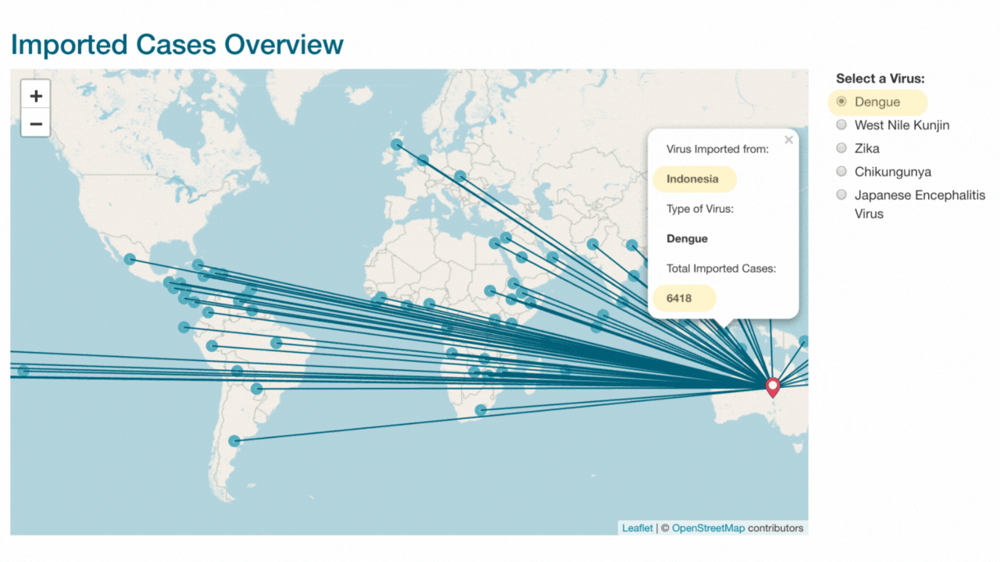


According to the map above, dengue is one of the greatest numbers of viruses entering Australia, with a total of 9,218 imported cases. Countries such as Indonesia (6,545 cases) and Thailand (1,387) exported almost 86% of the total number of dengue viruses in Australia. Another virus-like Chikungunya is the second most imported virus, with 241 cases imported from Indonesia and 476 from India. In comparison, the West Nile/Kunjin virus has one of the lowest numbers of importation of the virus in Australia, with only 6 cases reported. As a result, the nations with the most instances of the virus in Australia are Indonesia, Thailand, and India, which contribute 6667, 1367, and 591 cases, respectively.

### Viruses Locally Transmitted 

Apart from viruses that are imported from countries around the world, there are a few viruses that are locally transmitted too. Viruses like RRV, BFV and MVEV, originated from Australia and hence are being locally transmitted. Other viruses like DENV and WNV are found both locally and across different countries. 

Dengue reappeared in north Queensland in 1981–1982, 25 years after it had been absent, and its prevalence has risen ever since. The rise in foreign travel, a key contributor to the emergence and spread of infectious illnesses, is linked to this. Concurrent to this, these viruses have been moving south towards the New South Wales border and west towards the Northern Territory border from north Queensland.

In 1995, the Torres Strait had the first known outbreak of Japanese encephalitis in the Australasian area. In the centre of Torres Strait, Badu Island recorded three occurrences, two among which were fatal. (Hanna et al., 1996).

### Locally Acquired vs Imported Cases

There are eight different viruses in all that we are dealing with, five of which are classified as imported and five as locally transmitted. The reason for this is that both groups contain the dengue virus and the West Nile/Kunjin virus. As a result, locally-transmitted viruses are Ross River, Barmah Forest, Murray Valley Encephalitis, Dengue, and West Nile/Kunjin viruses. Chikungunya, Japanese Encephalitis, Zika, Dengue, and West Nile/Kunjin Viruses are foreign acquired viruses. 

The visualisations for these were added by taking into account these requirements given by our supervisor:

1. Group Year (2007 - 2011, 2012 - 2017)

2. Ability to compare locally-acquired and imported cases

3. Examine the incidence rates for the different viruses

We created a group of radio buttons so that the user can choose between the 2 group years. Furthermore, we built another radio button group so that the transmission type (locally acquired or imported) can also be toggled between. We also added a select input for the user to be able to choose from the virus list. This virus list will update itself when the transmission type is switched between locally acquired and imported because the virus list is not the same for them. As for the visualisation itself, we created a choropleth map that maps the colour in a region to the incidence rate. We choose our colour palette to be from blue to red which depicts lower incidence rates as blue and gradually changes to red as the incidence rate increases. Likewise, we also added a tooltip that shows up when the user clicks any SA3 region. 

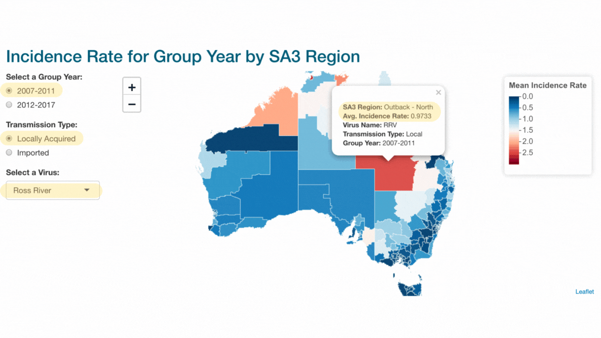

Apart from this, we also created an animated bar chart that compares the incidence rate for all the viruses based on their transmission type through the years 2007 - 2017. This was done using the gganimate package in R. 

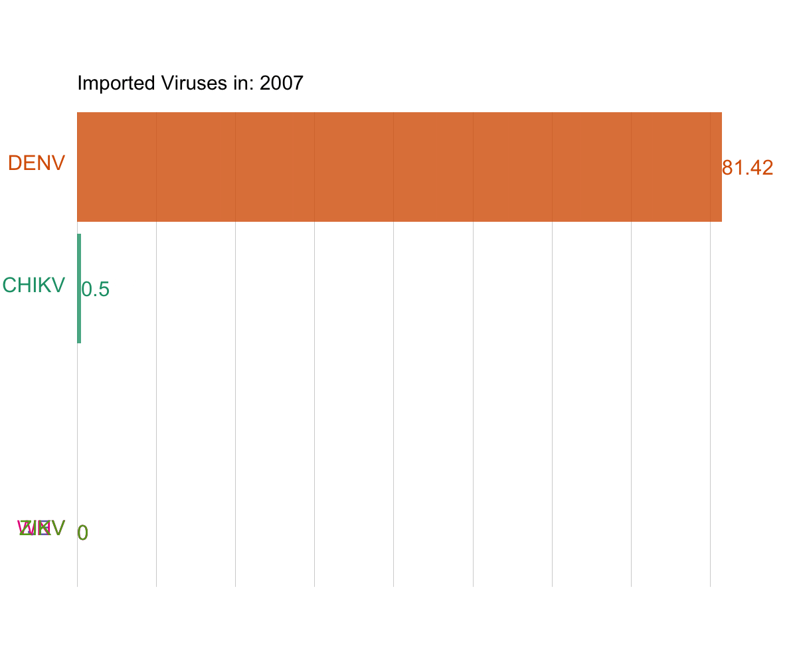
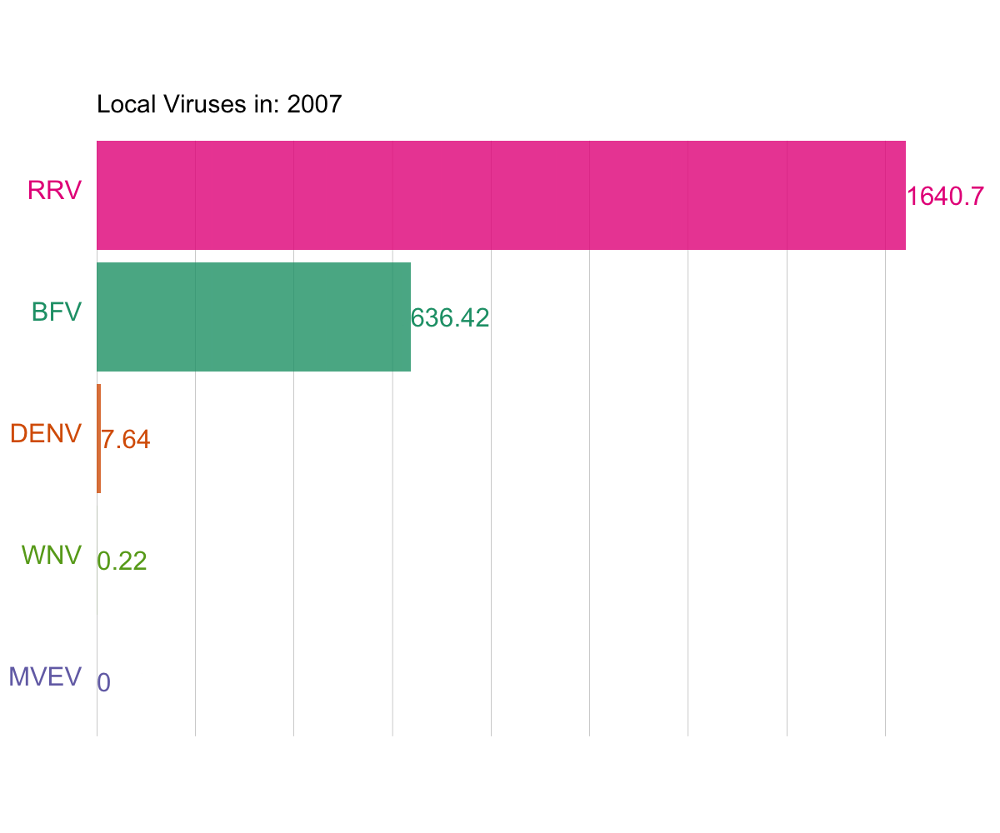

From the animation graph above, we can see that for locally transmitted viruses, Ross River virus and Barmah Forest virus are much higher than the other viruses, and in contrast to this, we have West Nile Kunjin virus with the lowest sum incidence rate for virtually all the years. Moving on to the foreign-acquired viruses, we notice that the dengue virus has been continuously high from 2007 to 2017, followed by the competition between Chikungunya and Japanese Encephalitis viruses. When it comes to imported viruses, the West Nile/Kunjin virus has the lowest occurrence rate for both categories.

We discovered that the highest occurrence of locally-transmitted viruses occurred in 2015. The highest incidence of imported viruses occurred in 2016, after breaking down the data by year for the animation above. The prevalence of viruses acquired abroad was lowest in 2007, whereas that of locally-transmitted viruses was lowest in 2016. It is interesting to note that 2013 has the second-highest total incidence rate for viruses that are acquired locally and abroad.

## Blood donation rate

When a person has lost blood due to surgery or injury, blood transfusion is a potentially life-saving process where lost blood is replaced. This is done through a routine medical procedure in which donated blood is pushed in through a tube placed on a vein which is usually in the arm. However, this process also has the ability to spread a variety of species, such as bacteria, viruses, and parasites, potentially leading to an infection. Transfusion-transmitted infections (TTIs) are infections that develop after receiving blood transfusions from an infected individual. (Diseases and Organisms | Blood Safety | CDC, 2019).  Since tests for these arboviruses are not always performed, there is a higher chance of collecting infected blood if the blood donor is asymptomatic (infected but without symptoms), which increases the risk that the blood recipient will get sick because their immune system is likely to have been compromised by their current state of health. Therefore, we thought the danger of the spread of arboviruses by blood transfusion might affect the incidence rate of virus transmission.

The donation rate is an important factor in understanding the transmission of arbovirus in any region. There may also be a relationship between the blood donation rate and incidence rate. Therefore, we wanted to investigate this further and create appropriate visualisations. In order to do this, we selected variables like the donation rate, Year and incidence rate. We used data from the Australian Red Cross Lifeblood to create the graphic for the blood donation rate. The age, gender, and geographic location of the donor are used to collect the data. A bubble map would be an appropriate representation of the variables along with a line graph to discover any trends in the data. A bubble map is similar to a bubble graph but with a map embedded in it. The colour of the bubbles represents the average donation rate in that region and the size of the bubble describes the average incidence rate in that area. A date slider was added as a user input which can be used to narrow down the Year to see a pattern for a particular period or for a single year. Also, a select input with the list of SA3 regions is added so that the user can choose to select 1 or more SA3 regions and try to compare the results. Besides this, we built a line graph that shows the change in average incidence and donation rate over the years. This would also be a helpful graphic to understand the trend and seasonality of the data. The lines and bubbles are modified with the input of chosen SA3 locations and the slider input of years.

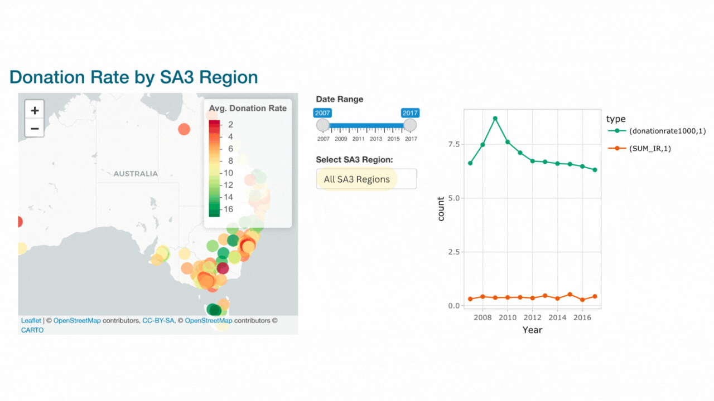

Australia's high and low blood donation locations are depicted on the bubble map in green and red, respectively. We also have a line graph with the incidence rate indicated in red and the donation rate displayed beside the map highlighted in green.

## Statistical Analysis

We performed some statistical analysis in order to uncover underlying patterns, trends, and other significant details in the data. In order to understand the relationship between the different variables and know which variable has a significant effect on the incidence or the donation rate, we built a series of statistical models by considering different combinations of variables. Statistical analysis provides context and explanations for the otherwise vague numbers in the dataset (Ali & Bhaskar, 2016). Though visualisations are the sole purpose of this project, the results and inferences are definitive only when statistically tested and quantitatively proven. Therefore, a statistical analysis was carried out on the data set along with creating the visualisations. 


### Negative Binomial 

We performed a Negative Binomial Distribution, which is a discrete probability distribution for random variables (Negative Binomial & Zero-Inflated Models in R Using Microbiome Data | Nutribiomes, n.d.). The random variable is the number of iterations that result in a certain success rate. To put it another way, it is the frequency of failures prior to success (Stephanie, 2015).
 
We specifically selected negative binomial regression, a technique very close to multiple regression. There is one difference, though: in negative binomial regression, the dependent variable follows the negative binomial. The variables can therefore be positive or negative integers. These regressions are one of the most popular modelling techniques for overdispersed count outcome variables.

Negative binomial regression can be used when the conditional variance is greater than the conditional mean, as is the case for over-dispersed count data  (Negative Binomial Distribution, n.d.). As seen from the table below, the variance is not so much greater but yet justifies negative binomial regression.


```{r, out.width = "70%", fig.align = "center"}
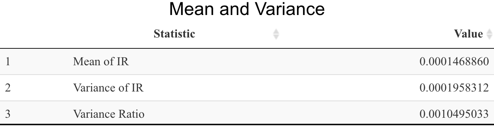
```


We conducted the regressions by keeping the donation rate as our predictor variable and the incidence rate as the dependent variable for all the models. In addition to several negative binomial regressions, we also used Poisson regression to see if the data contained count data, which are discrete data with non-negative integer values (Huang, 2019). Also, negative binomial regression shares many common assumptions with Poisson regression, such as linearity in model parameters, independence of individual observations, and the multiplicative effects of independent variables.

```{r, out.width = "70%", fig.align = "center"}
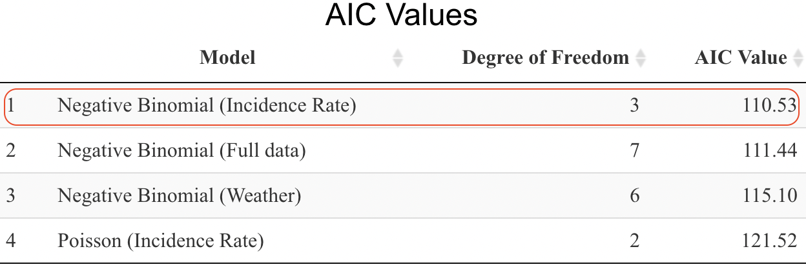
```


Negative Binomial (Weather) and Negative Binomial (Full Data) have additional parameters like weather conditions (rainfall, temperature, and humidity) and all variables respectively as their dependent variables. We used the Akaike information criterion (AIC) as a metric to evaluate the quality of our models. Low complexity and a good fit are indications of a model with a low AIC. We discovered that expanding the number of parameters improves the AIC values of negative binomial regression. As a result, we chose the basic negative binomial model (donation rate as our predictor variable and the incidence rate as the dependent variable) for further analysis.


#### Negative Binomial Summary

The table below shows the summary statistics of the full data negative binomial.

```{r, out.width = "70%", fig.align = "center"}
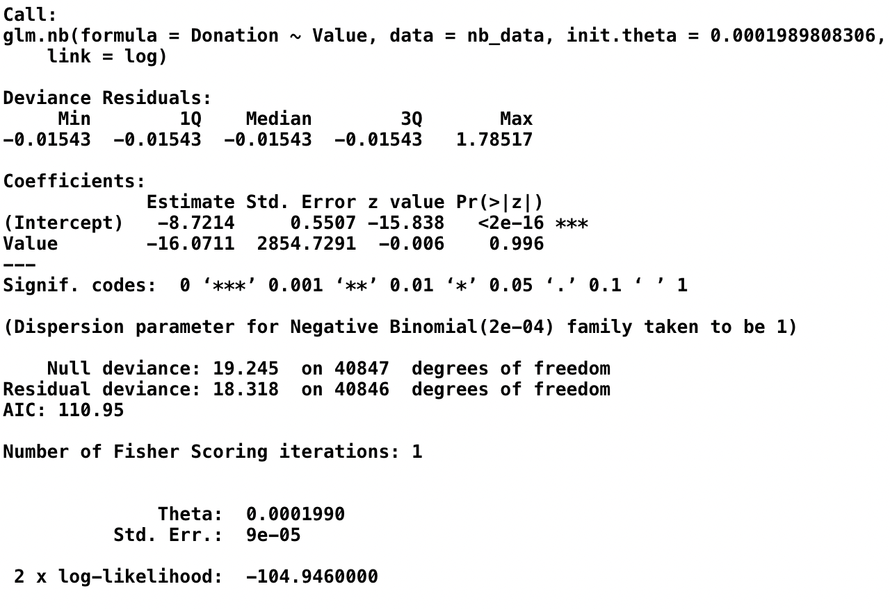
```

Because the median deviance residual is almost zero, our model is not biased in either way, which means the outcome is neither overestimated nor underestimated.

Coefficients: We have established the hypotheses H0 and H1 in order to analyse the negative binomial. H0 is the ultimate determinant (donation rate), and it is unrelated to the dependent variable, whereas H1 is related to the dependent variable. According to the p-value we have (0.996), which is higher than 0.05. The null hypothesis is not rejected since the divergence from it is not statistically significant. A valid null hypothesis is more consistent with the sample data when the P-value is higher. Furthermore, lower P-values indicate that the sample data do not support the null hypothesis. Although the coefficients are associated, they are not substantial enough to provide a sound conclusion. 

Null Deviance: It is implied by a low null deviation that the data can be adequately described by utilising the intercept alone. If the null deviation is significant, then fitting the model with more than one parameter makes sense, but for our model, it is not true.

Residual Deviance: We have a low residual deviation, which indicates our trained model is suitable.

Degree of freedom: The residual deviation should be near to the degrees of freedom for a well-fitting model, however, it is not the case in this instance.


#### Under and overfitting of data

```{r, out.width = "100%", fig.align = "center"}
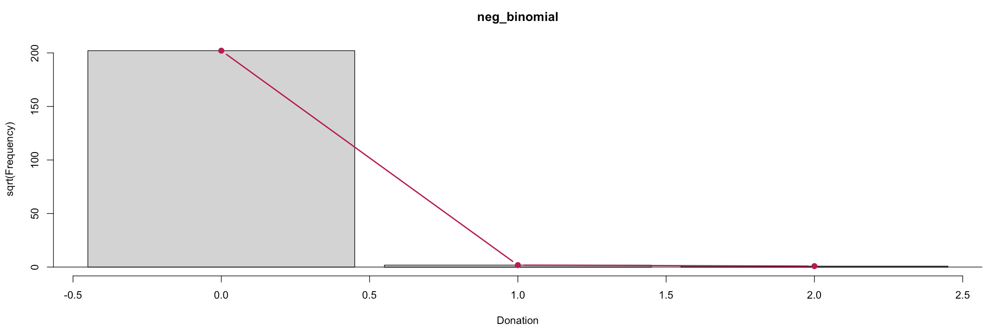
```

The theoretical Negative Binomial fit is represented by the red curved line. The height indicates the gap between expected and observed numbers is "hanging" from each position on the bar. A hanging bar below 0 suggests underfitting, whereas a hanging bar above 0 indicates overfitting and because the bars do not lie in just about any direction, indicating the data is a well-fitted model. 

Additionally, we have used a method called zero-inflated negative binomial regression to determine if the data particularly accumulated at a zero distribution. Negative binomial regression with zero inflation is used to model count variables containing excessively many zeros, typically for overdispersed count outcome variables. Theoretically speaking, the extra zeros may be represented independently and are produced by a different process from the count values (Zero-Inflated Negative Binomial Regression | R Data Analysis Examples, n.d.). When we performed Zero-Inflated Negative Binomial Regression on the fundamental negative binomial model (with the incidence rate as the dependent variable and the donation rate as the predictor variable), we received all NA values as a result. Consequently, we made the decision not to pursue it further.


### Principal Component Analysis

The other statistical analysis that we performed was a Principal Component Analysis of the blood donation data. It is a well-known unsupervised learning method for decreasing the dimensionality of data. It is one of the most extensively used techniques for a wide range of tasks, including data de-noising, information compression, and exploratory data analysis. While preventing information loss, it simultaneously improves interpretability (Principal Component Analysis in Machine Learning | Simplilearn, n.d.). Vectors make up the primary components, but they are not picked at random. The biplot that we produced (distance biplot), shown below, makes it simple to understand the key components.


```{r, out.width = "70%"}
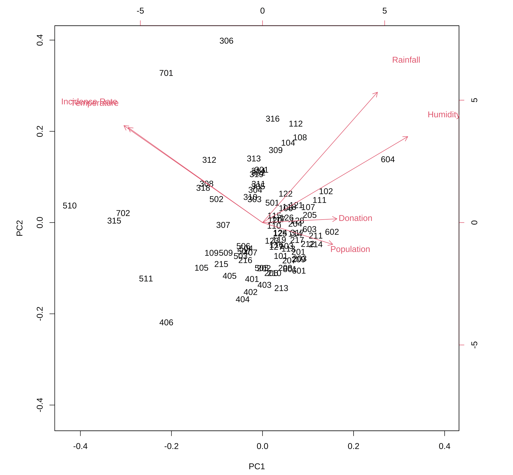
```


```{r, out.width = "40%"}
pca_table <- read_csv("images/pca_table.csv")

pca_table %>% datatable(escape = FALSE, 
                  caption = htmltools::tags$caption (style = 'caption-side: top; text-align: center;  
                                                              color: black; font-family: Arial; 
                                                              font-size: 120% ;', 'SA4 Regions'))
```


Instead of SA3 regions, the graph above uses SA4 regions. Despite the fact that we are solely focusing on the SA3 regions in the report, presenting all 334 codes would have been chaotic and confusing. So instead, we opted to perform a Principal Component Analysis (PCA) on 88 SA4 regions. Also, in order to comprehend the graph better, we have a reference table containing all of the SA4 codes and the names of the SA4 regions. The graph displays all the significant factors that were utilised to estimate the incidence rate caused by arboviruses. To account for the most variation in the original characteristics, the very first principal component is calculated. After the first principal component, the second component, orthogonal to the first, explains the most variation (Wicklin, 2019). So for the first principal component, we have the donation rate and population contributing the highest, which is also found to be moving in the same direction. This is due to the fact that the donation rate is computed using the population variable. Another interesting thing to note is that temperature and incidence are highly correlated.

From the Biplot, we also found that regions like 604 and 102 (West and North West and, Central Coast) witness higher humidity while 506 and 509 ( Perth - South East, Western Australia - Wheat Belt) experience it less. Regions like 602 and 603 (Launceston and North East and South East) have a similar ratio for the blood donation rate and population. Region 205 (Latrobe - Gippsland) has a higher blood donation rate given its population size whereas 211 (Melbourne - Outer East) is bigger in population. Yet, we see a lower blood donation rate in the former region compared to the blood donation rate in the latter. Another interesting thing to note is that temperature and incidence rate are highly correlated. For rainfall, no regions had a significant association with the independent variable, donation rate. Finally, we have some regions (e.g., 308-Fitzroy and 318-Townsville) which experience higher temperatures and have a higher incidence rate than the rest. 

The correlation between temperature and incidence rate was an intriguing finding in the Principal Component Analysis, which led us to our next segment where we investigated the effects of different weather conditions with respect to the incidence rate.


## Effects of Weather Conditions 

The potential impacts of global warming on human health have received a lot of attention in recent years. The contagious infections most likely to be impacted by global warming, are those spread particularly by viruses carried by mosquitoes. It is commonly acknowledged that weather has a significant role in the development of epidemics of human arboviral illness in Australia. According to Tozan et al., 2020, the transmission of such arboviral infections is highly sensitive to both climatic and non-climatic conditions. A slight change in weather patterns can cause tremendous alterations in virus transmission cycles. In particular, epidemics of these viruses might be brought on by excessive rain and flooding. Understanding the relationship between various weather conditions and virus transmission can help you be more prepared when such weather changes occur. Let us have a deeper look at each weather condition below.


### Temperature

The whole life cycle of a vector is temperature and humidity-dependent. Hence, vector competence, which is the physiological ability of a mosquito to become infected with and its ability to transmit disease (Kain et al., 2022), is also temperature and humidity-dependent. Different species react differently to changes in temperature, though. Vector competence should increase with an increase in temperature within a certain range.  Additionally, blood-feeding, which is when insect vectors feed on animals to take their blood (also known as hematophagy), is susceptible to changes in temperature. Apart from this, mating is also massively affected by temperature. A temperature rise is supposed to make the virus move more towards the poles and to regions with higher elevations (where the temperature is low). 
 

Australia is a country with diverse weather patterns. Understanding the relationship between arbovirus transmission and a country with such diverse weather conditions is critical. Therefore, we decided to understand the impact of temperature on incidence rate by SA3 region and year. Since the dataset contained minimum and maximum temperatures, we obtained the average temperature by adding the minimum and maximum temperature values and dividing them by 2. Since both average temperature and incidence rate are numerical variables, we choose to find the correlation between them by building a linear model. This model was chosen because a negative or positive correlation between the two numeric variables can be easily identified. The linear model uses least squares to fit a line to the data points and the degree of correlation is Pearson’s correlation coefficient (Chambers, 2017). This correlation value ranges from -1 and + 1. If the incidence rate increases as the temperature increases then the correlation between them is said to be positive. Whereas, if the incidence rate decreases as the temperature decreases, then the 2 variables are said to have a negative relationship between them. We aim to find a negative correlation between them because according to Robert et al., (2020). As they mention that arbovirus transmission may decrease because they cannot handle warm temperatures we would like to know if it is true for Australia.  


```{r, out.width = "70%", fig.align = "center"}
knitr::include_graphics("images/temp.png")
```

Based on this graph, it can be inferred that temperature and incidence rate has a slightly positive correlation. That is the incidence rate increases as temperature increases. Therefore, the claim made by Robert et al., (2020) is true for arbovirus transmission in Australia. Next, we wanted to understand if this has anything to do with the SA3 regions. Since temperature is highly region based we wished to determine if the transmission was high in regions with higher temperatures. Since this involves a spatial variable, we used a choropleth map to see the significance of region on temperature and thereby understand the relationship between temperature and incidence rates. 
 


```{r, out.width = "50%", fig.align = "center"}
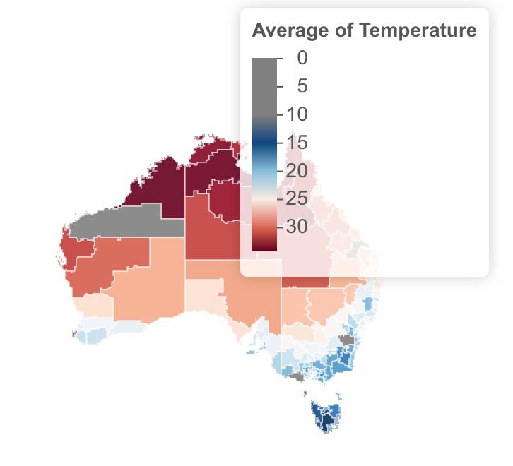
```

As can be noticed here, the temperature decreases gradually from the Northern to Southern Australian regions. The incidence rate is also higher for Northern regions when compared to the southern regions. 


### Rainfall

Rainfall can have a delayed effect on the transmission of arbovirus(Lowe et al., 2018). So, determining the effects of rainfall on transmission can be very difficult since it also depends on the ecological conditions. Some vectors prefer to breed and lay eggs in containers filled with water hence increasing the vector population as mentioned by Epstein (2007). Since we are focussing on the incidence rate and rainfall, we would like to discover the dependency of the incidence rate on rainfall. Disease outbreaks usually occur after a lagged period of heavy rainfall in a region. With increased rainfall, the amount of larvae increases. However, just this increase cannot be a precursor to arboviral transmission as a larvae has to mature and go through metamorphosis before it can become a carrier of any virus (Stewart et al., 2013). However, we are not interested in understanding the lagged relationship between rainfall and incidence rate since it is out of the scope of this project. Just like with temperature, we laid out the average rainfall rate and incidence rate on a linear model. Ideally, increased rainfall should increase the incidence rate as mentioned earlier.


```{r, out.width = "70%", fig.align = "center"}
knitr::include_graphics("images/rain.png")
```

This is evident from the graph above as there is a slight positive correlation between the 2 variables. Following this, we hoped to see if there was a relationship between these 2 variables and the SA3 regions. Again, we used a choropleth map to investigate this. 


```{r, out.width = "50%", fig.align = "center"}
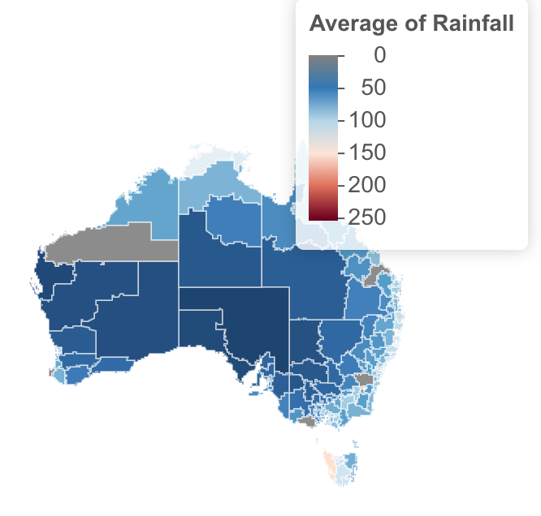
```

Coastal regions like Cassowary, Mackay, Port Doughlas, etc. have high rainfall and incidence rates. However, a very evident relationship is not observed between SA3 regions, rainfall and incidence rates. Similar to temperature, rainfall rate and incidence rate do not show any trend or seasonality over the years too.


### Relative Humidity

As previously stated, temperature and humidity have an impact on a vector's life cycle. Numerous viruses have been demonstrated to be sensitive to the surrounding humidity, although the exact processes behind this phenomenon are still unknown. The relationship between relative humidity (RH) and viability has been thoroughly reviewed in a WHO report (Sobsey & Meschke, 2003.).  We have compared RH (the ratio of the actual water vapour pressure to the saturation vapour pressure of the surrounding air) with the incidence rate of infections. 


```{r, out.width = "70%", fig.align = "center"}
knitr::include_graphics("images/humid.png")
```

The dataset contained the mean minimum and maximum RH by SA3 regions. Just like the other two temperature variables, we constructed a linear model graph to find correlations between the RH and the virus's incidence rate. The linear model shows a slightly negative correlation which indicates that the incidence rate increases as the relative humidity decreases, and hence the correlation between them is negative. 

```{r, out.width = "50%", fig.align = "center"}
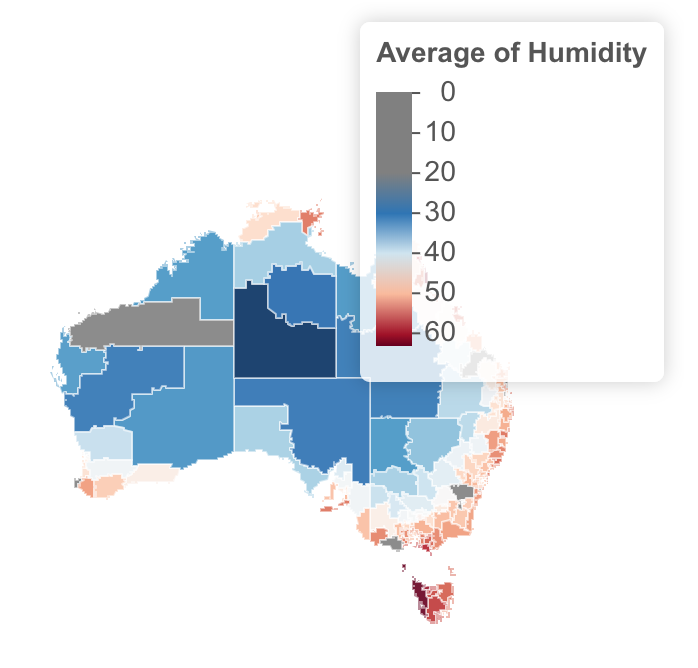
```

According to Yang & Marr (2012), we discovered that while non - enveloped viruses are more durable at higher RH, enveloped viruses, which have a lipid coating, stick around longer at lower RH. Since we are dealing with the genus of RNA viruses known as alphaviruses, which likely appear to have an outer membrane (Wikipedia Contributors, 2019), they can thrive better in less humid environments. The map above illustrates that Australia's coastal regions have greater humidity levels, as winds travelling from the sea to land carry a considerable amount of moisture with them. They substantially increase the humidity in coastal regions. As a result, compared to the inland of the country, viral transmission is relatively lower close to the shores. No matter the temperature of your area, research demonstrates that a space with 50% humidity may not only provide you with the comfort you want but is also proven to enable quick viral inactivation, with fewer than 1% of viruses still active after two days (How Healthy Humidity Can Help Fight Viruses and More, 2021).


## Results and Discussion

The various analysis and visualisations created helped in answering the research questions that were mentioned earlier. When comparing the imported and locally transmitted cases, Dengue is the virus with the highest number of imported cases whereas West Nile Kunjin and Japanese Encephalitis virus have the lowest number of imported cases. The incidence rate is generally high for the Palmerston region for all viruses. However, this could also be due to it being a larger SA3 region when compared to the rest. Ross river Virus is one of the highly transmitted viruses locally within Australia. Following this is the Barmah Forest virus which shows a sudden increase in the year 2013. Dengue virus is the most highly imported virus. It is interesting to note that Dengue cases are high when imported but one of the least when locally acquired. After performing the statistical analysis, it can be concluded that though the explanatory variables show a significant relationship with the incidence rate, the same cannot be said for the donation rate. Both temperature and rainfall show a positive correlation with the incidence rate. However, humidity does not show any significant relationship with the incidence rate. All the 3 weather conditions do not have any strong association with the SA3 regions and they do not depict strong trends or seasonality. However, east coast subtropical climatic regions include New South Wales and Queensland. This entails greater temperatures and noticeable rainy seasons together with high humidity that is practically year-round (Climate in Australia, n.d.). The places located on the eastern shore areas, which therefore experience more extreme weather conditions, are the outliers in our weather linear model graphs.

The shiny app that was built along the way is a culmination of all the analysis and visualisations that were done. We ensured that the code was modularised using the concept of shiny modules. Apart from this, we also worked on creating maps from scratch using shapefiles and also using the leaflet package. We have made the app as interactive as possible by adding various user inputs. The maps and graphs also show interactivity when clicked or hovered over. As far as the styling of the app is concerned, we made use of CSS, HTML and in-built shiny themes to make the app look aesthetic. We used GitHub extensively to collaborate with each other and also used it for version control. 

One hindrance that we faced during the development of this project was the size of the dataset. Since the dataset was very huge and we had to merge them with shape files that contained boundary information of the SA3 regions, the size of the data got huge impacting the processing of the app. Another limitation of the project would be the models and variables we considered during the statistical analysis. Due to time constraints, we were unable to extensively use the different variables provided to us and also take into account other variables that could significantly contribute to understanding the patterns in arbovirus transmission. We also wished to take into account the daily temperature data to identify unique trends in the data. However, this could have led to the data becoming, even more, bigger which would lead to computational issues. 


## Individual Contributions

This project has allowed us to explore various realms of software development and project management. The project kickstarted with understanding each of our strengths and weaknesses along with multiple brainstorming sessions on ways to implement the task at hand. This involved, choice of visualisations, statistical models, design of the app, etc. Both of us did most of the work together by meeting twice a week and tackling the problems at hand together. During the initial phase of the project, we set up agile as our project management and software development approach. Therefore, it was easy for us to work in sprints with major tasks broken down into simpler tasks for us to work on. This project has been a very good learning experience for both of us and both of us have contributed equally to the development of the project. 


## Conclusion

Arbovirus transmission is increasing day by day, due to the change in weather patterns and increased cross-border travel. Understanding the reason behind the transmission of such viruses is crucial in dealing with the repercussions of it. In this era, we need to use technology as an important tool in making stories out of the raw data we possess. So, we built a shiny app that could visually present facts and figures about arbovirus transmission in Australia. This added value to the findings that were obtained from the statistical analysis and other patterns that existed in the data. Adding to this, statistical modelling of the data has led to a better understanding of the relationships between the variables that surround arboviral transmission. This app can be used in other settings where studies about other viral transmissions are carried out or for other countries that seek to understand the spread of this virus in their country. This project has also helped us hone our skills in shiny app development, project management and active collaboration through [GitHub](https://github.com/pjai0005/Analysis-on-Arbovirus-Transmission). Overall, it has been a very enriching experience for us to have worked on a project like this. 


## Reference

Acheme, I., & Vincent, O. (2021). Machine-learning models for predicting survivability in COVID-19 patients. Data Science For COVID-19, 317-336. doi: 10.1016/b978-0-12-824536-1.00011-3

Ali, Z., & Bhaskar, S. (2016). Basic statistical tools in research and data analysis. Indian Journal Of Anaesthesia, 60(9), 662. doi: 10.4103/0019-5049.190623

Arboviral diseases and malaria in Australia, 2007/08: Annual report of the National Arbovirus and Malaria Advisory Committee. (2009). Health.gov.au; Australian Government Department of Health and Ageing. https://www1.health.gov.au/internet/main/publishing.nsf/Content/cda-cdi3302b.htm

Australian Bureau of Statistics. Regional population. 2021; Available from:
https://www.abs.gov.au/statistics/people/population/regional-population/2019-20#data-download.

Australian Bureau of Statistics. Regional population methodology. 2021; Available from:
https://www.abs.gov.au/methodologies/regional-population-methodology/2019-20.

Australian Bureau of Statistics, ERP by SA2 (ASGS 2016), Age and Sex, 2001 Onwards.
2021.

Australian Government Department of Health. 2019. Australia&#39;s notifiable disease status, 2015: annual report of the National Notifiable Diseases Surveillance System. Communicable Diseases
Intelligence, 43. https://doi.org/10.33321/cdi.2019.43.6

Australian Statistical Geography Standard (ASGS) | Australian Bureau of Statistics. (2022, May 10). Www.abs.gov.au. https://www.abs.gov.au/statistics/statistical-geography/australian-statistical-geography-standard-asgs

Chambers, J. M. (2017). Linear models. In Statistical models in S (pp. 95-144). Routledge.

Chang, Winston, Joe Cheng, JJ Allaire, Carson Sievert, Barret Schloerke, Yihui Xie, Jeff Allen, Jonathan McPherson, Alan Dipert, and Barbara Borges. 2021. Shiny: Web Application Framework for r. https://shiny.rstudio.com/.

Climate in Australia. (n.d.). Worlddata.info. https://www.worlddata.info/australia/australia/climate.php

Diseases and Organisms | Blood Safety | CDC. (2019, May 7). Www.cdc.gov. https://www.cdc.gov/bloodsafety/bbp/diseases-organisms.html#:~:text=Transfusion%2Dtransmitted%20infections%20(TTIs)

Division, C. D. of H. and F. S. P. H. (n.d.). Arboviruses in the Australian region, 1990 to 1998. Www1.Health.gov.au; Commonwealth Department of Health and Family Services. https://www1.health.gov.au/internet/main/publishing.nsf/Content/cda-pubs-cdi-1998-cdi2206-cdi2206a.htm

Epstein P. R. (2007). Chikungunya Fever resurgence and global warming. The American journal of tropical medicine and hygiene, 76(3), 403–404.

Hanna, J.H., Ritchie, S.A., Phillip, D.A., Shield, J., Mackenzie, J.S., Poidinger, M., McCall, B.J. and Mills, P.J. (1996). An outbreak of Japanese encephalitis in the Torres Strait, Australia, 1995. Medical Journal of Australia, [online] 165(5). Available at: https://www.mja.com.au/journal/1996/165/5/outbreak-japanese-encephalitis-torres-strait-australia-1995.

How Healthy Humidity Can Help Fight Viruses and More. (2021, June 10). AprilAire - Blog. https://www.aprilaire.com/blog/how-healthy-humidity-can-help-fight-viruses-and-more-season-after-season/

Huang, F. L. (2019, May 21). Poisson and Negative Binomial Regression using R. Francis L. Huang. https://francish.netlify.app/post/poisson-and-negative-binomial-regression-using-r/

Kain, M. P., Skinner, E. B., Athni, T. S., Ramirez, A. L., Mordecai, E. A., & van den Hurk, A. F. (2022). Not all mosquitoes are created equal: A synthesis of vector competence experiments reinforces virus associations of Australian mosquitoes. PLOS Neglected Tropical Diseases, 16(10), e0010768. https://doi.org/10.1371/journal.pntd.0010768

Kelleher, C., & Wagener, T. (2011). Ten guidelines for effective data visualization in scientific publications. Environmental Modelling & Software, 26(6), 822-827.

Liu, H., Shah, S., & Jiang, W. (2004). On-line outlier detection and data cleaning. Computers & chemical engineering, 28(9), 1635-1647.

Lowe, R., Gasparrini, A., Van Meerbeeck, C. J., Lippi, C. A., Mahon, R., Trotman, A. R., Rollock, L., Hinds, A., Ryan, S. J., & Stewart-Ibarra, A. M. (2018). Nonlinear and delayed impacts of climate on dengue risk in Barbados: A modelling study. PLoS medicine, 15(7), e1002613. https://doi.org/10.1371/journal.pmed.1002613

Main Features - Main Features. (2011). Abs.gov.au; c=AU; o=Commonwealth of Australia; ou=Australian Bureau of Statistics. https://www.abs.gov.au/AUSSTATS/abs@.nsf/Lookup/1270.0.55.001Main+Features1July%202011?OpenDocument

Negative Binomial Distribution. (n.d.). Stattrek.com. https://stattrek.com/probability-distributions/negative-binomial

Negative Binomial & Zero-Inflated Models in R using Microbiome Data | Nutribiomes. (n.d.). Www.youtube.com. Retrieved October 25, 2022, from https://www.youtube.com/watch?v=MxiLPvV2kQU

Principal Component Analysis in Machine Learning | Simplilearn. (n.d.). Simplilearn.com. https://www.simplilearn.com/tutorials/machine-learning-tutorial/principal-component-analysis

Queensland Government. SILO. 2021; Available from: https://www.longpaddock.qld.gov.au/silo/.

Robert, M. A., Stewart-Ibarra, A. M., & Estallo, E. L. (2020). Climate change and viral emergence: evidence from Aedes-borne arboviruses. Current opinion in virology, 40, 41-47.

RStudio Team, RStudio. 2020.

Sallum, M.A.M., Conn, J.E., Bergo, E.S., Laporta, G.Z., Chaves, L.S.M., Bickersmith, S.A., de Oliveira, T.M.P., Figueira, E.A.G., Moresco, G., Olívêr, L., Struchiner, C.J., Yakob, L. and Massad, E. (2019). Vector competence, vectorial capacity of Nyssorhynchus darlingi and the basic reproduction number of Plasmodium vivax in agricultural settlements in the Amazonian Region of Brazil. Malaria Journal, 18(1). doi:10.1186/s12936-019-2753-7.

Sobsey, M. D., & Meschke, J. S. (2003). Virus survival in the environment with special attention to survival in sewage droplets and other environmental media of fecal or respiratory origin. Report for the World Health Organization, Geneva, Switzerland, 70.

Stephanie. (2015, April 20). Negative Binomial Experiment / Distribution: Definition, Examples. Statistics How To. https://www.statisticshowto.com/negative-binomial-experiment/

Stewart Ibarra, A. M., Ryan, S. J., Beltrán, E., Mejía, R., Silva, M., & Muñoz, A. (2013). Dengue vector dynamics (Aedes aegypti) influenced by climate and social factors in Ecuador: implications for targeted control. PloS one, 8(11), e78263. https://doi.org/10.1371/journal.pone.0078263

Tozan, Y., Sjödin, H., Muñoz, Á.G. and Rocklöv, J. (2020). Transmission dynamics of dengue and chikungunya in a changing climate: do we understand the eco-evolutionary response? Expert Review of Anti-infective Therapy, 18(12), pp.1187–1193. doi:10.1080/14787210.2020.1794814.

Wickham, H., & Grolemund, G. (2016). R for data science: import, tidy, transform, visualize, and model data. " O'Reilly Media, Inc.".

Wicklin, R. (2019, November 6). What are biplots? [Review of What are biplots?]. SAS. https://blogs.sas.com/content/iml/2019/11/06/what-are-biplots.html

Wikipedia Contributors. (2019, September 19). Viral envelope. Wikipedia; Wikimedia Foundation. https://en.wikipedia.org/wiki/Viral_envelope

Yang, W., & Marr, L. C. (2012). Mechanisms by which ambient humidity may affect viruses in aerosols. Applied and environmental microbiology, 78(19), 6781–6788. https://doi.org/10.1128/AEM.01658-12

Zero-Inflated Negative Binomial Regression | R Data Analysis Examples. (n.d.). Stats.oarc.ucla.edu. https://stats.oarc.ucla.edu/r/dae/zinb/
